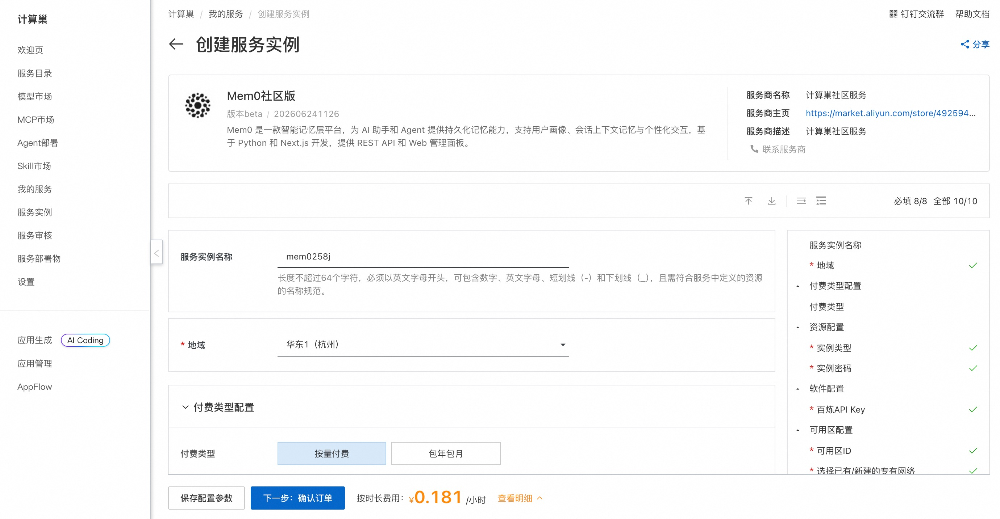
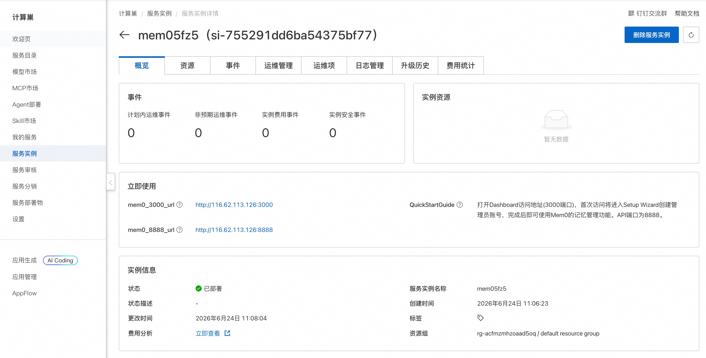
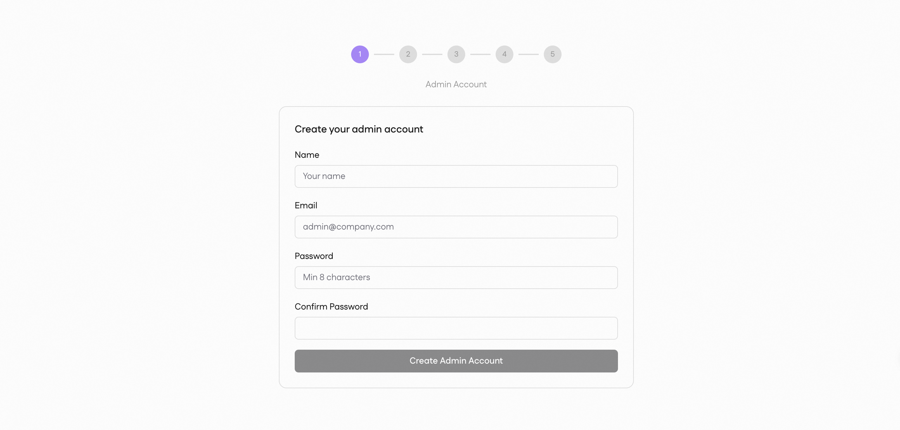
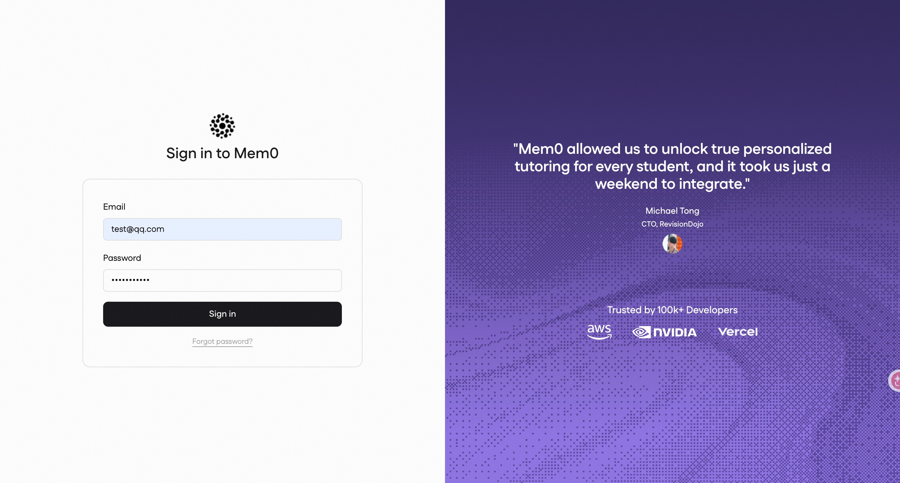

# Mem0社区版 部署文档

## 概述

Mem0 是一款智能记忆层平台，为 AI 助手和 Agent 提供持久化记忆能力，支持用户画像、会话上下文记忆与个性化交互。基于 Python 和 Next.js 开发，提供 REST API（默认监听 8888 端口）和 Web 管理面板（默认监听 3000 端口）。通过阿里云计算巢服务，您可以快速部署 Mem0 社区版，实现开箱即用。

## 部署流程

### 1. 创建服务实例

访问 Mem0 社区版 服务部署链接，按提示填写部署参数：

[部署链接](https://computenest.console.aliyun.com/service/instance/create/cn-hangzhou?type=user&ServiceId=service-9978480a14844d14928d)

### 2. 确认订单并创建

参数填写完成后可以看到对应询价明细，确认参数后点击 **下一步：确认订单**。确认订单完成后同意服务协议并点击 **立即创建** 进入部署阶段。

### 3. 等待部署完成

等待部署完成后进入服务实例管理，在控制台找到 Mem0 社区版 Dashboard 访问链接（`mem0_3000_url`）和 API 访问链接（`mem0_8888_url`）。

### 4. 访问服务

单击 `mem0_3000_url` 链接访问 Dashboard，首次访问将进入 Setup Wizard 创建管理员账号。

注册完成后即可登录使用访问 Mem0 的记忆管理功能。

## 官方文档

更多信息请访问官方文档：[Mem0 官方文档](https://docs.mem0.ai)
